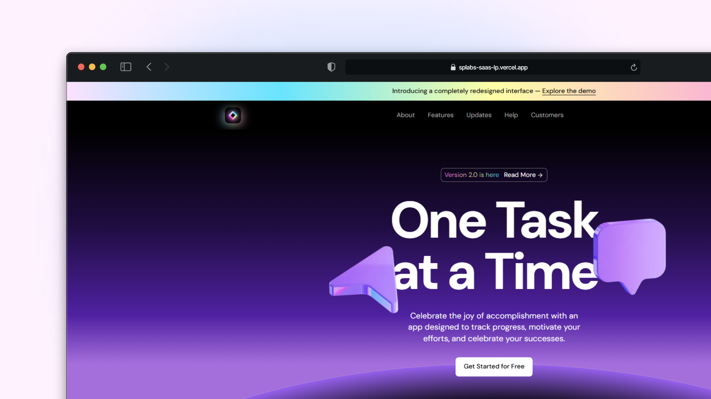

# Saas Landing Page

🎨 Design Inspiration : https://www.figma.com/community/file/1347551304372055519

### 🪛 Technologies used

- Next.js 16
- TailwindCSS v4
- Typescript
- Shadcn/ui
- Motion (originally known as framer-motion)

### ☑️ How to run this project?
To run this project on your local environment, follow the following steps :
- Clone the repository to your local machine or download the source code.
- Run the command `pnpm install` in the project directory to install the **required** dependencies
- Run the command `pnpm preview` to start the `production build` of the project.
- Open your internet browser and go to the following address: [http://localhost:3000](http://localhost:3000)
